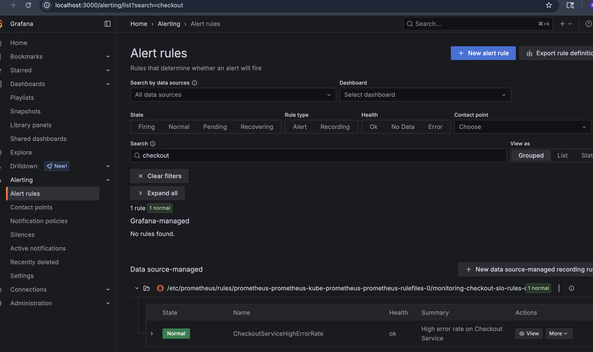
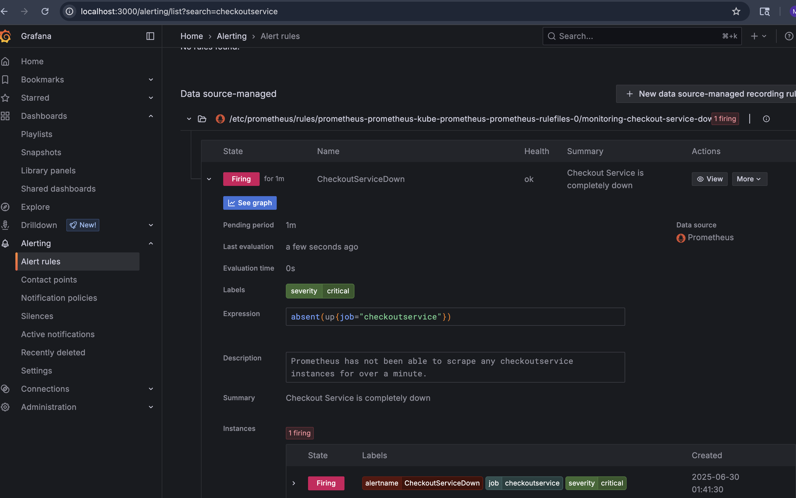

# eks-observability
<a id="readme-top"></a>

[![Issues][issues-shield]][issues-url]
[![MIT License][license-shield]][license-url]
[![LinkedIn][linkedin-shield]][linkedin-url]

<br />
<div align="center">
  <a href="https://github.com/Manimanohar1/eks-observability">
        
  </a>

<h3 align="center">Chaos Engineering & Observability using EKS</h3>

  <p align="center">
    An end-to-end project demonstrating core Site Reliability Engineering (SRE) principles. Deployed a microservices application on EKS, implemented a full observability stack with Prometheus and Grafana, defined SLOs, and proactively tested system resilience using Chaos Engineering.
    <br />
    <a href="https://github.com/Manimanohar1/eks-observability/tree/main/kube-configs"><strong>Explore the Config Files »</strong></a>
    <br />
    <br />
  </p>
</div>

<details>
  <summary>Table of Contents</summary>
  <ol>
    <li>
      <a href="#about-the-project">About The Project</a>
      <ul>
        <li><a href="#built-with">Built With</a></li>
      </ul>
    </li>
    <li>
      <a href="#replicating-the-environment">Replicating the Environment</a>
      <ul>
        <li><a href="#prerequisites">Prerequisites</a></li>
        <li><a href="#setup">Setup</a></li>
      </ul>
    </li>
    <li><a href="#sre-experiments-and-findings">SRE Experiments and Findings</a></li>
    <li><a href="#roadmap">Roadmap</a></li>
    <li><a href="#contact">Contact</a></li>
    <li><a href="#acknowledgments">Acknowledgments</a></li>
  </ol>
</details>

## About The Project

![Architecture Diagram][project-screenshot]

The primary goal of this project was to learn and demonstrate core telementry and observability principles in a realistic cloud environment. This involved deploying a microservices application on Amazon EKS, implementing a  observability stack to monitor its health, defining reliability targets (SLOs), and proactively testing the systems resilience to failure using Chaos Engineering. The extensive troubleshooting journey was a critical part of the project, highlighting real-world challenges in cloud-native environments.

<p align="right">(<a href="#readme-top">back to top</a>)</p>

### Built With

This project was built using the following key technologies:
* **Cloud:** AWS (Amazon EKS, EC2, Application Load Balancer)
* **Containerization:** Kubernetes, Docker
* **Infrastructure as Code:** eksctl, Helm, Kubernetes YAML
* **Observability:** Prometheus, Grafana
* **Chaos Engineering:** Chaos Mesh

<p align="right">(<a href="#readme-top">back to top</a>)</p>

## Replicating the Environment

Here are the high-level steps and tools required to replicate this project environment.

### Prerequisites

You will need the following command-line tools installed and an active AWS account.
* AWS CLI
* eksctl
* kubectl
* helm

### Setup

1. **Provision the EKS Cluster**
   ```sh
   # Creating the EKS control plane and worker nodes
   eksctl create cluster --name resilient-cluster --region us-west-2 --nodes 3
2.  **Deploy the Application**
    Clone the "Online Boutique" repository and apply the standard Kubernetes manifests to deploy all the microservices.
    ```sh
    git clone [https://github.com/GoogleCloudPlatform/microservices-demo.git](https://github.com/GoogleCloudPlatform/microservices-demo.git)
    cd microservices-demo
    kubectl apply -f ./release/kubernetes-manifests.yaml
    ```

3.  **Install Controllers & Observability Stack**
    Use Helm to install the necessary platforms into the cluster.
    ```sh
    # Install AWS Load Balancer Controller for Ingress
    helm install aws-load-balancer-controller eks/aws-load-balancer-controller -n kube-system ...

    # Install Prometheus & Grafana for observability
    helm install prometheus prometheus-community/kube-prometheus-stack --namespace monitoring --create-namespace

    # Install Chaos Mesh for chaos engineering
    helm install chaos-mesh chaos-mesh/chaos-mesh -n chaos-testing --create-namespace
    ```

4.  **Apply Custom Configurations**
    Apply the custom YAML files to configure traffic management, SLO alerting, and chaos experiments. These files can be found in the `kube-configs` directory of this repository.
    ```sh
    
    kubectl apply -f k8s-configs/ingress-http.yaml

    kubectl apply -f k8s-configs/slo-alert.yaml
    ```
## SRE Experiments and Findings

The core of the project was to test the systems resilience and validate the observability stack. Two experiments were conducted.

### Experiment 1: Non-Critical Service Failure

* **Hypothesis:** Terminating the non-critical `recommendationservice` will not affect the checkout process or breach its SLO.
* **Action:** Used Chaos Mesh to inject `pod-kill` failures into the `recommendationservice` deployment for 5 minutes.
* **Findings:** The experiment proved the hypothesis. The main site remained functional, and the `CheckoutServiceHighErrorRate` alert remained in a 'Normal' state, confirming the failure was successfully isolated.

<div align="center">
  
</div>

### Experiment 2: Critical Service Failure & SLO Validation

* **Hypothesis:** A complete outage of the `checkoutservice` will be detected by our custom alerts.
* **Action:** Used `kubectl scale --replicas=0` to simulate a total service outage.
* **Findings:** This test validated both of our SLO alerts. The `CheckoutServiceDown` alert fired correctly because the `absent(up{...})` query became true. After generating failed checkout attempts on the website, the `CheckoutServiceHighErrorRate` alert also fired.

<div align="center">
  
</div>

<p align="right">(<a href="#readme-top">back to top</a>)</p>

## Potential Roadmap

- [ ] Implement HTTPS using a custom domain and AWS Certificate Manager.
- [ ] Configure a Grafana "Contact Point" to send firing alerts to an email address.
- [ ] Design and run more advanced Chaos Engineering experiments, such as latency or resource injection.


<p align="right">(<a href="#readme-top">back to top</a>)</p>

## Contact

LinkedIn - [LinkedIn Profile](https://linkedin.com/in/manikandeshwar-manohar)  

Email - [Email](mailto:manishmanohar10@gmail.com)

Github - [GitHub](https://github.com/Manimanohar1)

<p align="right">(<a href="#readme-top">back to top</a>)</p>

## Acknowledgments

A special thanks to the creators and maintainers of the excellent open-source tools that made this project possible.

* [Google Cloud - Online Boutique Microservices Demo](https://github.com/GoogleCloudPlatform/microservices-demo)
* [Best-README-Template](https://github.com/othneildrew/Best-README-Template)
* [Chaos Mesh](https://chaos-mesh.org/)
* [Prometheus Community](https://prometheus.io/)
* [Grafana Labs](https://grafana.com/)

<p align="right">(<a href="#readme-top">back to top</a>)</p>

[issues-shield]: https://img.shields.io/github/issues/Manimanohar1/eks-observability.svg?style=for-the-badge
[issues-url]: https://github.com/Manimanohar1/eks-observability/issues
[license-shield]: https://img.shields.io/github/license/Manimanohar1/eks-observability.svg?style=for-the-badge
[license-url]: https://github.com/Manimanohar1/eks-observability/blob/master/LICENSE.txt
[linkedin-shield]: https://img.shields.io/badge/-LinkedIn-black.svg?style=for-the-badge&logo=linkedin&colorB=555
[linkedin-url]: https://linkedin.com/in/YOUR_LINKEDIN_USERNAME
[project-screenshot]: images/architecture.png
[graphana_ok]: images/graphana_ok.png
[graphana_notok]: images/graphana_nok.png
